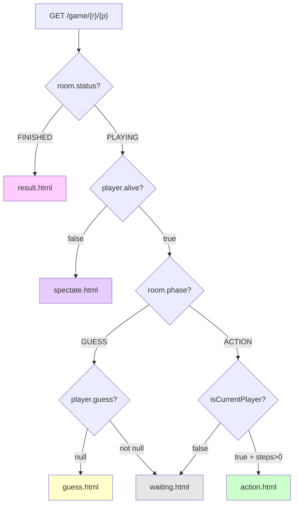

# API 速查表

## 页面路由（9 个，返回 Thymeleaf HTML）

| 方法 | URL | 参数 | 返回值 | 说明 |
|:----:|-----|------|--------|------|
| `GET` | `/` | — | `index` 模板 | 首页：创建/加入房间表单 |
| `POST` | `/create` | `count, name` | `redirect /lobby` | 创建房间，房主自动加入 |
| `POST` | `/join` | `roomId, name` | `redirect /lobby` 或 `/game` | 加入房间，根据状态跳转 |
| `GET` | `/lobby/{roomId}/{playerId}` | — | `lobby` 模板 | 等待大厅，含心跳更新 |
| `GET` | `/game/{roomId}/{playerId}` | — | 按状态分发模板 | 核心游戏页面分发 |
| `POST` | `/guess/{roomId}/{playerId}` | `gesture` | `redirect /game` | 提交猜拳 |
| `POST` | `/action/{roomId}/{playerId}` | `actionType, targetId?, city?` | `redirect /game` | 提交行动 |
| `GET` | `/leave/{roomId}/{playerId}` | — | `redirect /` | 离开房间 |
| `POST` | `/chat/{roomId}/{playerId}` | `message` | `redirect /game` | 发送聊天 |

## AJAX API（5 个，返回 JSON `@ResponseBody`）

| 方法 | URL | 参数 | 返回值 | 说明 |
|:----:|-----|------|--------|------|
| `GET` | `/api/room/{roomId}` | `?playerId=` | `{status, phase, players[], logs, chat, ...}` | **核心轮询接口** |
| `POST` | `/api/guess/{roomId}/{playerId}` | `gesture` | 同上 | 提交猜拳 + 返回状态 |
| `POST` | `/api/action/{roomId}/{playerId}` | `actionType, targetId?, city?` | 同上 + `actionMessage` | 执行行动 + 返回结果 |
| `POST` | `/api/chat/{roomId}/{playerId}` | `message` | `String[]` 聊天列表 | 发送消息 + 返回历史 |
| `POST` | `/lobby/{roomId}/{playerId}/start` | — | `{success, error?}` | 房主强制开始 |

## `/api/room/{roomId}` 返回值结构

核心轮询接口返回的 JSON 包含完整的房间快照：

```json
{
  "status": "WAITING|PLAYING|FINISHED",
  "phase": "GUESS|ACTION",
  "players": [
    {
      "id": "string",
      "name": "string",
      "hp": 10,
      "alive": true,
      "city": 1,
      "location": "CITY|WILD",
      "guess": "ROCK|SCISSORS|PAPER|null",
      "steps": 0,
      "horse": false,
      "knife": false,
      "isCurrentPlayer": false
    }
  ],
  "logs": ["string"],
  "chat": ["string"],
  "actionMessage": "string | null"
}
```

## 页面分发逻辑



## 行动类型参数

| actionType | 行动 | 额外参数 | 说明 |
|:----------:|------|----------|------|
| 0 | 放弃 | — | 放弃本轮行动 |
| 1 | 移动 | `city` | 城内↔城外切换 |
| 2 | 买马 | — | 获得马 |
| 3 | 买刀 | — | 获得刀 |
| 4 | 踢 | `targetId` | 马攻击（3伤害） |
| 5 | 刺 | `targetId` | 刀攻击（1伤害） |
| 6 | 血祭 | — | HP减半，下次攻击x2 |
| 7 | 撵入 | `targetId, city` | 强制移动目标玩家 |

## 猜拳参数

| gesture 值 | 说明 |
|:----------:|------|
| `"ROCK"` | 石头 |
| `"SCISSORS"` | 剪刀 |
| `"PAPER"` | 布 |
