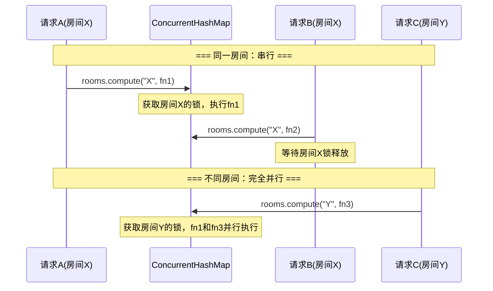

# 并发模型

MaDaoGame 采用**按房间粒度细粒度锁**的并发策略，同一房间操作串行，不同房间完全并行。

## 核心机制：rooms.compute()



## 并发组件清单

| 组件 | 位置 | 作用 |
|------|------|------|
| `ConcurrentHashMap<String, GameRoom>` | `GameService.rooms` | 高并发读安全，`compute()` 实现按房间粒度写锁 |
| `AtomicReference<T>` | `joinRoom()` / `executeAction()` | 在 `compute` 闭包中传递返回值 |
| `CopyOnWriteArrayList<Player>` | `GameRoom.players` | 写时复制，适合读多写少场景 |
| `rooms.compute()` | 所有写操作入口 | 核心理念：不同房间并行，同房间先到先执行 |

## 双副本同步策略

### 写入时序

```
写操作流程:
1. DB优先写入: playerDao.update(dbPlayer)
2. 内存同步:    memPlayer.setXxx()
3. 若DB写入失败 → compute()抛出异常回滚，内存不被污染
```

关键设计：**先写 DB，再同步内存**。如果 DB 写入失败，`compute()` 中的 lambda 抛出异常，ConcurrentHashMap 的 `compute` 方法不会提交修改，内存保持一致性。

### 读取策略

```
读操作流程:
1. 内存优先: rooms.get(roomId)
2. 缓存未命中: GameDao.findById() + PlayerDao.findByRoomId()
3. 从DB恢复完整房间对象，放入内存
```

## 锁粒度对比

| 方案 | 粒度 | 并发度 | MaDaoGame 采用 |
|------|------|:------:|:--------------:|
| `synchronized` 方法 | 整个 Service | ❌ 低 | |
| `synchronized(this)` | 实例级 | ❌ 低 | |
| `synchronized(roomId)` | 房间级 | ⚠️ 中（String intern 风险） | |
| `ConcurrentHashMap.compute()` | 房间级 | ✅ **高** | ✅ |

## AtomicReference 使用场景

在 `rooms.compute()` 的 lambda 闭包中无法直接 `return` 值，使用 `AtomicReference` 作为返回值容器：

```java
AtomicReference<String> result = new AtomicReference<>();
rooms.compute(roomId, (key, room) -> {
    // ... 业务逻辑 ...
    result.set(someValue);
    return room;  // 返回更新后的 room
});
return result.get();  // 获取闭包内的返回值
```

## CopyOnWriteArrayList 优势

`GameRoom.players` 使用 `CopyOnWriteArrayList` 而非普通 `ArrayList`：

- **读多写少**：轮询每秒大量读取玩家列表，加入/离开偶尔写入
- **写时复制**：写入时复制整个数组，读操作完全无锁
- **迭代安全**：遍历时不会抛出 `ConcurrentModificationException`

## 并发安全保证

| 操作 | 并发控制 | 说明 |
|------|----------|------|
| 创建房间 | `rooms.put()` | 原子插入 |
| 加入房间 | `rooms.compute()` | 同一房间串行，检查满员/同名/状态 |
| 提交猜拳 | `rooms.compute()` | 同一房间串行，原子判定全部出拳 |
| 执行行动 | `rooms.compute()` | 同一房间串行，原子修改HP/位置 |
| 离开房间 | `rooms.compute()` | 同一房间串行，原子移除玩家 |
| 清理房间 | `rooms.compute()` | 原子检查 activity 并移除 |

**结论**：所有可能并发修改同一房间数据的操作，均通过 `rooms.compute()` 串行化，从根本上杜绝竞态条件。
