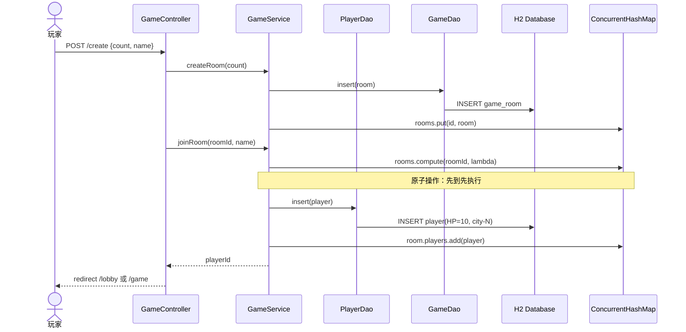
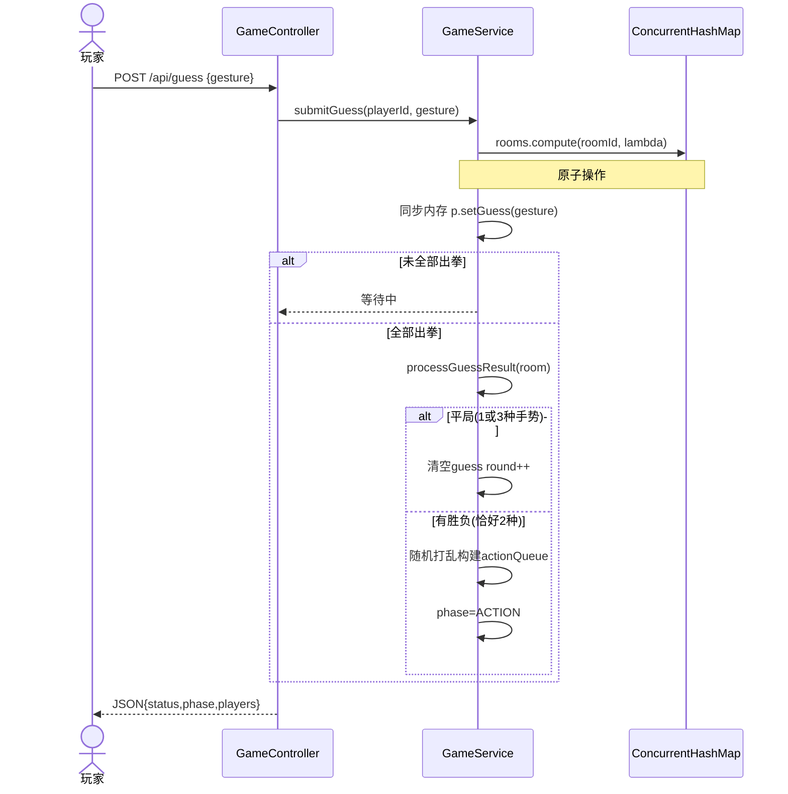
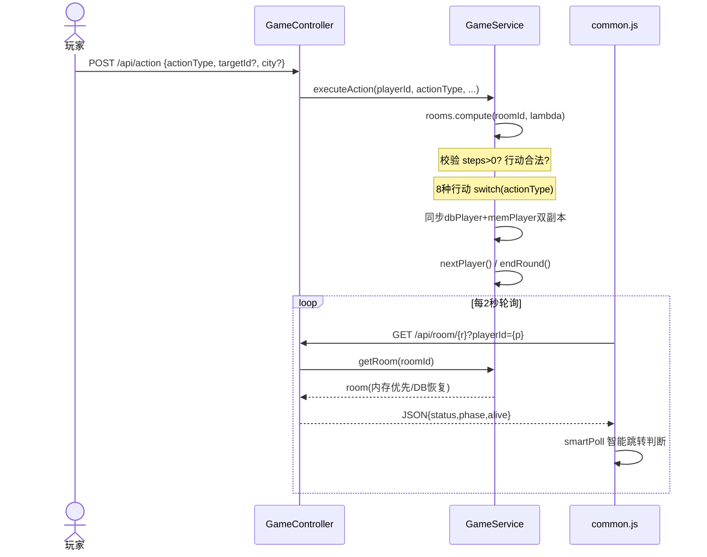

# 架构概览

MaDaoGame 采用经典的五层分层架构，职责清晰、松耦合。

## 五层架构图

## 分层职责

| 层级 | 组件 | 职责 |
|------|------|------|
| 启动层 | `MadaoGameApplication` | `@SpringBootApplication` 入口，`@ComponentScan` 注册所有组件 |
| 控制层 | `GameController` | 9 页面路由 + 5 AJAX API + 心跳检测 |
| 服务层 | `GameService` | 房间 CRUD / 猜拳判定 / 8 种行动 / 定时清理 |
| 数据访问层 | `GameDao` + `PlayerDao` | game_room 和 player 表的 INSERT/UPDATE/DELETE |
| 工具层 | `DBUtil` + HikariCP + H2 | 连接池管理 + 自动建表 + 静态查询 |

## 架构图连线说明

| 线型 | 含义 | 示例 |
|------|------|------|
| `→ (实线)` | `@Autowired` 注入 / 方法调用 | Ctrl → Srv, GD → DBUtil |
| `-→ (虚线)` | 依赖声明 / 自动扫描 | `@DependsOn`, `@ComponentScan` |
| `{}` | 并发容器 / 锁保护 | `ConcurrentHashMap` + `rooms.compute()` |

## 房间生命周期状态机

### 状态转换速查

| 当前状态 | 触发条件 | 目标状态 | 关键方法 |
|----------|----------|----------|----------|
| `[*]` | 玩家创建房间 | `WAITING` | `createRoom()` |
| `WAITING` | 人满 / 房主强制开始 | `GUESS` | `startGame()` / `forceStartGame()` |
| `GUESS` | 全部出拳 + 胜负 | `ACTION` | `processGuessResult()` |
| `GUESS` | 平局（1/3种手势） | `GUESS` | `processGuessResult()` |
| `ACTION` | 队列空 + 多人 | `GUESS` | `endRound()` |
| `ACTION` | 队列空 + 1人存活 | `FINISHED` | `checkGameEnd()` |
| `FINISHED` | 2分钟无活动 | `[*]` | `cleanupInactiveRooms()` |

## 数据流

### 创建房间 + 加入房间

### 猜拳判定流程

### 行动执行 + 轮询跳转

## 文件职责表

### Java 后端（8 文件）

| 文件 | 行数 | 类型 | 核心职责 |
|------|:----:|------|----------|
| `MadaoGameApplication.java` | ~40 | 启动类 | 入口 + `@ComponentScan` |
| `controller/GameController.java` | ~615 | `@Controller` | 9页面路由 + 5 AJAX + 心跳 |
| `service/GameService.java` | ~941 | `@Service` | 房间CRUD/猜拳/8行动/清理 |
| `entity/GameRoom.java` | ~246 | 实体 | 状态管理/actionQueue |
| `entity/Player.java` | ~121 | 实体 | HP钳制/装备/位置 |
| `dao/GameDao.java` | ~121 | `@Repository` | game_room 表CRUD |
| `dao/PlayerDao.java` | ~199 | `@Repository` | player 表CRUD |
| `util/DBUtil.java` | ~130 | `@Component` | 连接池+建表 |

### 前端模板（7 HTML + 1 Fragment）

| 文件 | 说明 |
|------|------|
| `index.html` | 首页（创建/加入表单） |
| `lobby.html` | 等待大厅（玩家列表+聊天） |
| `guess.html` | 猜拳界面 |
| `action.html` | 行动界面（8操作+目标选择） |
| `waiting.html` | 等待他人 |
| `spectate.html` | 观战模式 |
| `result.html` | 结果展示 |
| `fragments/rules.html` | 规则弹窗片段 |

## 设计模式一览

| 模式 | 应用位置 | 说明 |
|------|----------|------|
| 模板方法 | `common.js` → `createRoomPoller(config)` | 轮询骨架统一，回调注入差异 |
| 策略模式 | `executeAction()` → `switch(actionType)` | 8种行动对应8个策略分支 |
| 门面模式 | `GameService` | 统一对外API，屏蔽多层复杂性 |
| 副本模式 | `GameService` 写入逻辑 | DB优先写入→内存同步双副本 |
| 代理模式 | `rooms.compute()` | 按房间粒度串行化写入 |

## 配套图片

| 图片 | 说明 |
|------|------|
|  | 运行时部署拓扑 |
|  | 核心类关系图 |
