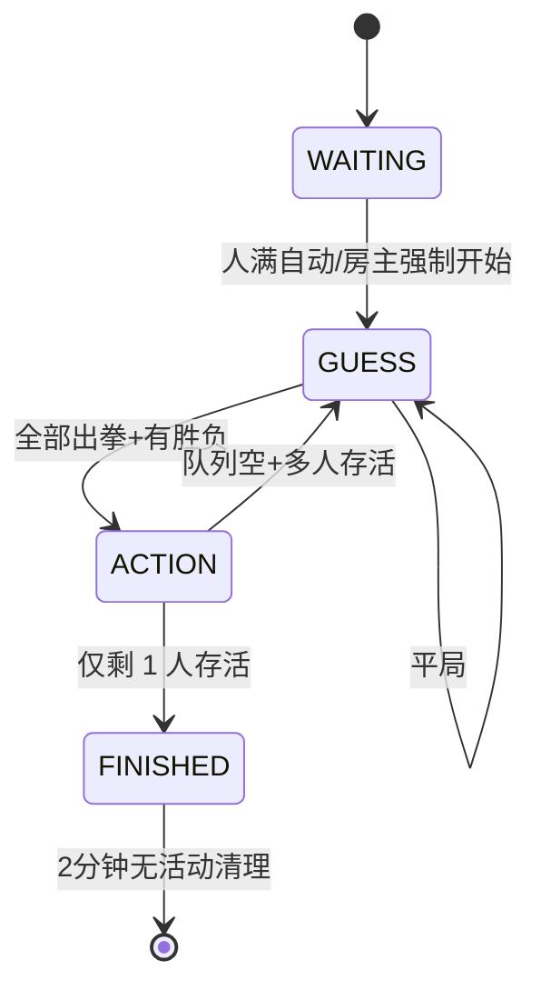

# 游戏规则

马刀游戏（MaDaoGame）是一款多人回合制网页对战游戏，融合「石头剪刀布」猜拳和「步数驱动」策略行动。

## 基本设定

### 地图与城市

- 初始每人拥有一座独立城市，玩家在各自的城内
- 城市之间是一片空地（城外），与每个城市相连接
- 城外是唯一的共享区域，除此外无其它连接

### 生命值与胜利条件

- 每位玩家初始拥有 **10 点生命值（HP）**
- 当 HP 降至 0 或以下时，该玩家出局
- 当场上仅剩一位存活玩家时，**该玩家获胜**

## 核心机制：步数系统

### 获取步数 — 石头剪刀布

通过猜拳获得步数。每回合所有存活玩家同时出拳：

| 克制关系 | 效果 |
|----------|------|
| 石头 克 剪刀 | 石头方获胜 |
| 剪刀 克 布 | 剪刀方获胜 |
| 布 克 石头 | 布方获胜 |

- **胜负局**（恰好 2 种手势）：胜方步数 = 被克制方人数
- **平局**（1 种或 3 种手势）：步数为 0，直接进入下一轮

### 消耗步数

- 有步数的玩家按**随机顺序**依次行动
- 必须在同一回合内**一次性消耗完所有步数**
- 每消耗 1 步数执行 1 次行动

## 行动类型（8 种）

| 编号 | 行动 | 消耗 | 使用区域 | 效果 |
|:----:|------|:----:|----------|------|
| 0 | 放弃 | 全部步数 | 任意 | 放弃本轮所有行动 |
| 1 | 移动 | 1 步 | 任意 | 城内→城外 或 城外→某城内 |
| 2 | 买马 | 1 步 | 任意 | 获得马（武器） |
| 3 | 买刀 | 1 步 | 任意 | 获得刀（武器） |
| 4 | 踢 | 1 步 | 仅城内 | 将同城玩家踢到城外，造成 **3 点伤害** |
| 5 | 刺 | 1 步 | 城内/城外 | 对同区域玩家造成 **1 点伤害** |
| 6 | 血祭 | 1 步 | 任意 | HP 减半（向上取整），下次攻击伤害 x2，不可叠加 |
| 7 | 撵入 | 1 步 | 仅城外 | 将城外某玩家强制移入指定城内 |

### 武器详情

| 武器 | 购买消耗 | 使用区域 | 伤害 |
|------|:--------:|----------|:----:|
| 马 | 1 步 | 仅城内 | 3 点 |
| 刀 | 1 步 | 城内/城外 | 1 点 |

### 血祭机制

- HP 减至一半，**向上取整**（1 点 HP 时无法血祭）
- 下一次攻击伤害 **翻 2 倍**（可跨回合保留）
- 不可叠加（已有 buff 时再次血祭无效）

## 游戏流程

### 各阶段说明

| 阶段 | 说明 | 触发条件 |
|------|------|----------|
| WAITING | 等待玩家加入 | 创建房间后 |
| GUESS | 收集出拳，判定胜负 | 游戏开始 / 上一回合结束 |
| ACTION | 胜者依次执行行动 | 猜拳产生胜负 |
| FINISHED | 展示结果，等待清理 | 仅剩 1 人存活 |

## 完整规则原文

> 初始情况：一个人有一座城，玩家在各自的城内，中间是一块空地（城外），与每个城相连接，除此外无其它连接。
>
> 通过消耗步数可以移动或攻击其它玩家。每个玩家有10点生命值，当生命值减至0时，该玩家出局。
>
> 获胜条件：当游戏只剩下一位玩家时，该玩家获胜。
>
> 步数：通过石头、剪刀、布获得，在胜负局中，每一个获胜的人可以获得，其数量为获胜拳所克制的玩家数。
>
> 消耗一次步数行动一次。当存在多位玩家有步数时，行使步数的顺序随机，且必须在同一回合内一次性消耗完所有步数。
>
> 移动：消耗一次步数，从某一城内移到城外，或从城外移到某一城内。
>
> 攻击：攻击需要使用武器，消耗一次步数可以获得马或刀（买马、买刀）。
>
> 马：只能在城内使用，当有其它玩家与你在同一个城内时，可以消耗一次步数，将他踢到城外（踢出去），同时他会减少3点生命值。
>
> 刀：可以在城内或城外使用，当有其它玩家与你在同一个区域时，可以消耗一次步数，刺他一刀，他会减少1点生命值。
>
> 血祭：消耗一次步数，生命值减至一半，向上取整（1点生命值时无法血祭），下一次的攻击翻2倍（可跨回合）不可叠加。
>
> 撵进去：当你与其它玩家在城外时，可以消耗一次步数，将其中一个玩家撵入一个城内。
