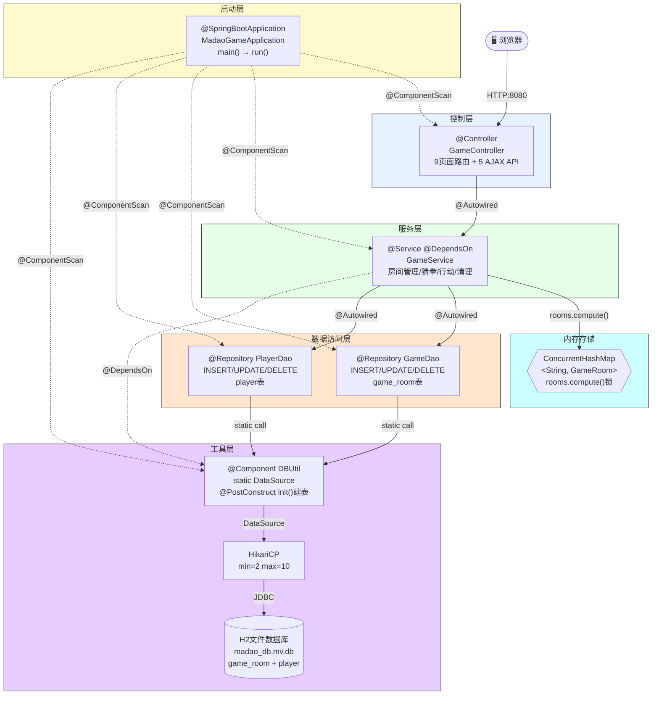
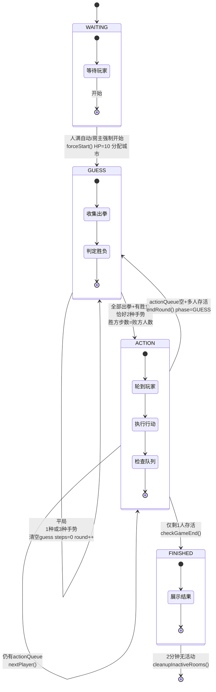
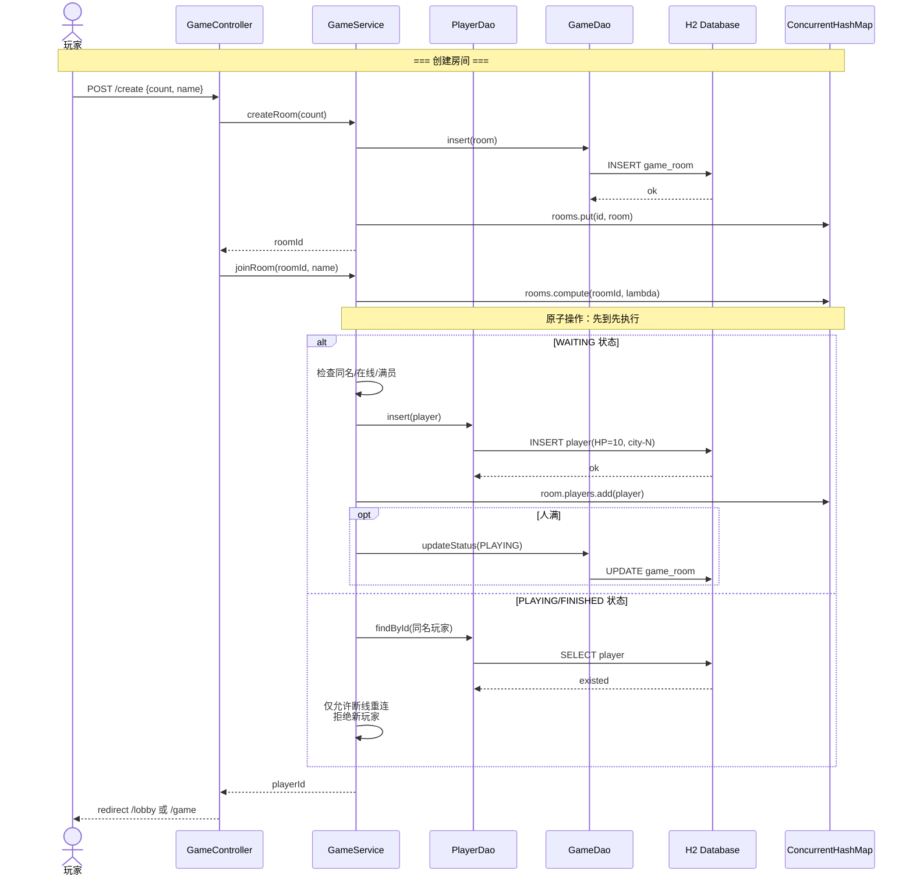
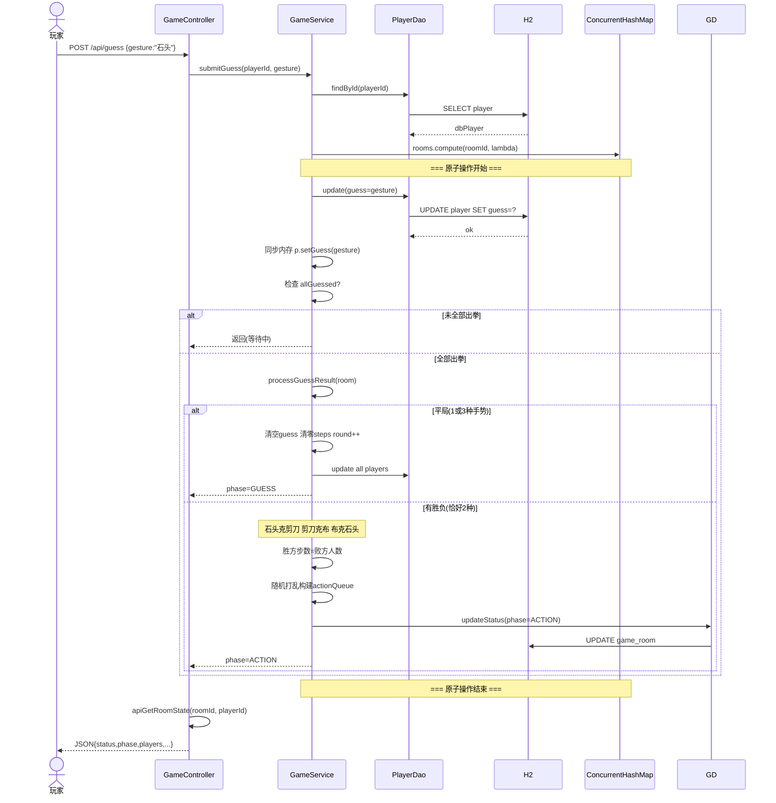
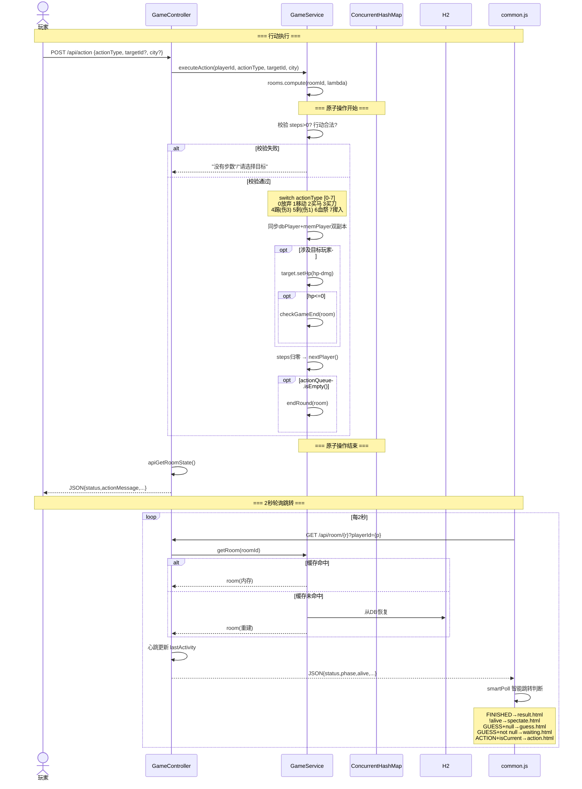
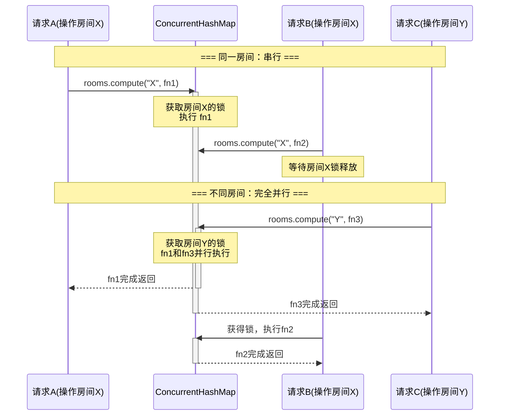
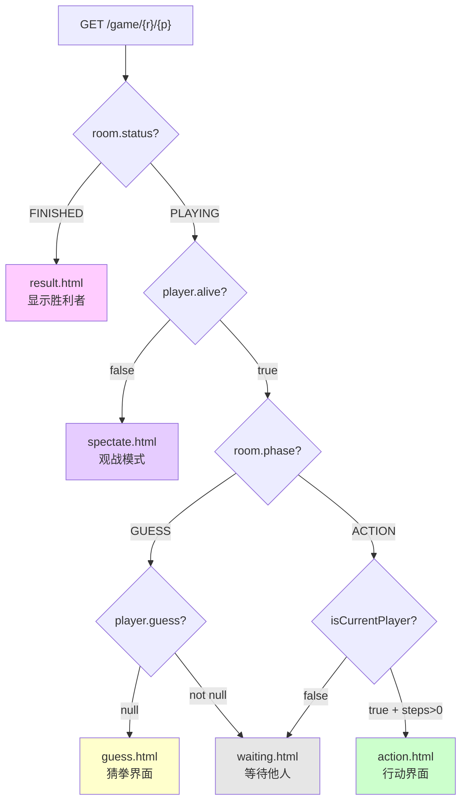

# MaDaoGame-Web 项目总览

> **文档定位**：可视化速查手册，侧重图表/流程图/表格。详细文字解读请参阅 [`PROJECT_GUIDE.md`](./PROJECT_GUIDE.md)。

---

## 1. 架构总览图

### 1.1 Mermaid 五层架构图



> 配套 PlantUML 专业级大图：[`project-overview-components.svg`](./project-overview-components.svg)

### 1.2 关键连线说明

| 线型 | 含义 | 示例 |
|------|------|------|
| `→ (实线)` | `@Autowired` 注入 / 方法调用 | Ctrl→Srv, GD→DBU |
| `-→ (虚线)` | 依赖声明 / 自动扫描 | `@DependsOn`, `@ComponentScan` |
| `{}` | 并发容器 / 锁保护 | ConcurrentHashMap + rooms.compute() |

---

## 2. 游戏生命周期流程图



> 配套 PlantUML 专业级状态机图：[`project-overview-state.svg`](./project-overview-state.svg)

### 状态转换速查

| 当前状态 | 触发条件 | 目标状态 | 关键方法 |
|----------|----------|----------|----------|
| `[*]` | 玩家创建房间 | `WAITING` | `createRoom()` |
| `WAITING` | 人满 / 房主强制开始 | `GUESS` | `startGame()` / `forceStartGame()` |
| `GUESS` | 全部出拳 + 胜负 | `ACTION` | `processGuessResult()` |
| `GUESS` | 平局（1/3种手势） | `GUESS` | `processGuessResult()` |
| `ACTION` | 队列空 + 多人 | `GUESS` | `endRound()` |
| `ACTION` | 队列空 + 1人存活 | `FINISHED` | `checkGameEnd()` |
| `FINISHED` | 2分钟无活动 | `[*]` | `cleanupInactiveRooms()` |

---

## 3. 数据流说明

### 3.1 创建房间 + 加入房间



### 3.2 猜拳判定流程（GUESS Phase）



### 3.3 行动执行 + 前端轮询跳转



---

## 4. 文件职责表

### 4.1 Java 后端（8 文件）

| 文件 | 行数 | 类型 | 核心职责 | 依赖 |
|------|------|------|----------|------|
| `MadaoGameApplication.java` | ~40 | 启动类 | `@SpringBootApplication` 入口 | `@ComponentScan` 注册所有组件 |
| `controller/GameController.java` | ~615 | `@Controller` | 9页面路由 + 5 AJAX API + 心跳 | `@Autowired GameService`, `PlayerDao` |
| `service/GameService.java` | ~941 | `@Service` | 房间CRUD/猜拳/8行动/定时清理 | `@Autowired GameDao,PlayerDao`, `@DependsOn DBUtil` |
| `entity/GameRoom.java` | ~246 | 实体类 | 状态管理/玩家列表/actionQueue | `CopyOnWriteArrayList<Player>` |
| `entity/Player.java` | ~121 | 实体类 | HP钳制/装备/位置/存活 | 无外部依赖 |
| `dao/GameDao.java` | ~121 | `@Repository` | game_room 表CRUD | `static call DBUtil` |
| `dao/PlayerDao.java` | ~199 | `@Repository` | player 表CRUD | `static call DBUtil` |
| `util/DBUtil.java` | ~130 | `@Component` | 连接池 + 自动建表 + 静态查询 | `@Autowired DataSource` → HikariCP |

### 4.2 前端模板（7 HTML + 1 Fragment）

| 文件 | 行数 | 类型 | 核心职责 | 被引方式 |
|------|------|------|----------|----------|
| `index.html` | ~150 | Thymeleaf | 首页（创建/加入表单） | `GET /` |
| `lobby.html` | ~250 | Thymeleaf | 等待大厅（玩家列表+聊天） | `GET /lobby/{r}/{p}` |
| `guess.html` | ~220 | Thymeleaf | 猜拳界面（石头/剪刀/布） | `game` 路由分发 |
| `action.html` | ~600 | Thymeleaf | 行动界面（8操作+目标选择） | `game` 路由分发 |
| `waiting.html` | ~180 | Thymeleaf | 等待他人（猜拳/行动） | `game` 路由分发 |
| `spectate.html` | ~170 | Thymeleaf | 观战模式（死亡玩家） | `game` 路由分发 |
| `result.html` | ~280 | Thymeleaf | 结果展示（胜利者） | `game` 路由分发 |
| `fragments/rules.html` | ~100 | 片段 | 游戏规则弹窗 | 各页面 `th:replace` |

### 4.3 静态资源 + 配置（5 文件）

| 文件 | 行数 | 类型 | 核心职责 | 加载方式 |
|------|------|------|----------|----------|
| `static/js/common.js` | ~320 | JavaScript | 2秒轮询/smartPoll/UI更新/聊天 | `<script>` |
| `static/css/common.css` | ~300 | CSS | 全局样式/玩家卡片/弹窗 | `<link>` |
| `application.properties` | 39 | Properties | 端口/H2/HikariCP/日志 | Spring Boot 自动加载 |
| `pom.xml` | 69 | XML | 依赖管理/构建配置 | Maven |
| `madao_db.mv.db` | — | 二进制 | H2 持久化文件 | JDBC URL |

---

## 5. 设计模式分析

| 模式 | 应用位置 | 代码特征 | 说明 |
|------|----------|----------|------|
| **模板方法** | `common.js` → `createRoomPoller(config)` | 提取通用 `fetchState` 骨架，各页面传入 `shouldRedirect`/`onUpdate` 回调 | 轮询框架统一，各页面差异由回调注入 |
| **策略模式** | `executeAction()` → `switch(actionType)` | 8种行动对应 8 个 case 分支，运行时动态选择执行策略 | 未来可重构为 Action 接口 + 各实现类 |
| **单例模式** | Spring `@Service`/`@Repository`/`@Component` | 默认 `singleton` scope | 全局唯一服务实例 |
| **观察者风格** | `common.js` → `smartPoll()` | 2秒轮询 `GET /api/room`，页面隐藏时保持心跳 | 非事件驱动但实现类似效果 |
| **门面模式** | `GameService` | 对外暴露统一 API（创建/加入/猜拳/行动），内部协调 Dao+DBUtil+内存 | 屏蔽多层数据访问复杂性 |
| **副本模式** | `GameService` 写入逻辑 | 先 `playerDao.update()` 写DB，再 `memPlayer.setXxx()` 同步内存 | 双副本保证持久化+性能 |
| **代理模式** | `rooms.compute()` | ConcurrentHashMap 的 compute 方法实现细粒度锁代理 | 以房间粒度串行化写入 |

---

## 6. 并发模型

### 6.1 rooms.compute() 工作原理



### 6.2 并发组件清单

| 组件 | 位置 | 作用 |
|------|------|------|
| `ConcurrentHashMap` | `GameService.rooms` | 高并发读安全，`compute()` 实现按房间粒度写锁 |
| `AtomicReference` | `joinRoom()` / `executeAction()` | 在 `compute` 闭包中传递返回值（lambda 不能直接 return） |
| `CopyOnWriteArrayList` | `GameRoom.players` | 写时复制，适合读多写少（轮询大量读，加入/离开偶尔写） |
| `rooms.compute()` | 所有写操作入口 | **核心理念**：不同房间完全并行，同一房间先到先执行 |

### 6.3 双副本同步时序

```
写操作:  DB优先写入 → 内存同步
        playerDao.update(dbPlayer)  →  memPlayer.setXxx()
        若DB写入失败抛出异常   →  compute()回滚，内存不会被污染

读操作:  内存优先读取 → 缓存未命中时从DB恢复
        rooms.get(roomId)  →  GameDao.findById() + PlayerDao.findByRoomId()
```

---

## 7. API 速查表

### 7.1 页面路由（9 个，返回 Thymeleaf HTML）

| 方法 | URL | 参数 | 返回值 | 说明 |
|------|-----|------|--------|------|
| `GET` | `/` | — | `index` 模板 | 首页：创建/加入房间表单 |
| `POST` | `/create` | `count, name` | `redirect /lobby` | 创建房间，房主自动加入 |
| `POST` | `/join` | `roomId, name` | `redirect /lobby` 或 `/game` | 加入房间，根据状态跳转 |
| `GET` | `/lobby/{roomId}/{playerId}` | — | `lobby` 模板 | 等待大厅，含心跳更新 |
| `GET` | `/game/{roomId}/{playerId}` | — | 按状态分发模板 | 核心游戏页面 |
| `POST` | `/guess/{roomId}/{playerId}` | `gesture` | `redirect /game` | 提交猜拳 |
| `POST` | `/action/{roomId}/{playerId}` | `actionType, targetId?, city?` | `redirect /game` | 提交行动 |
| `GET` | `/leave/{roomId}/{playerId}` | — | `redirect /` | 离开房间 |
| `POST` | `/chat/{roomId}/{playerId}` | `message` | `redirect /game` | 发送聊天 |

### 7.2 AJAX API（5 个，返回 JSON `@ResponseBody`）

| 方法 | URL | 参数 | 返回值 | 说明 |
|------|-----|------|--------|------|
| `GET` | `/api/room/{roomId}` | `?playerId=` | `{status,phase,players[...],logs,chat,...}` | **核心轮询接口**，获取房间完整快照 |
| `POST` | `/api/guess/{roomId}/{playerId}` | `gesture` | 同上 | 提交猜拳 + 返回最新状态 |
| `POST` | `/api/action/{roomId}/{playerId}` | `actionType, targetId?, city?` | 同上 + `actionMessage` | 执行行动 + 返回结果 |
| `POST` | `/api/chat/{roomId}/{playerId}` | `message` | `String[]` 聊天消息列表 | 发送消息 + 返回聊天历史 |
| `POST` | `/lobby/{roomId}/{playerId}/start` | — | `{success, error?}` | 房主强制开始 |

### 7.3 页面分发逻辑（`GET /game/{roomId}/{playerId}`）



---

## 配套文件索引

| 文件 | 格式 | 内容 | 适用场景 |
|------|------|------|----------|
| [`PROJECT_GUIDE.md`](./PROJECT_GUIDE.md) | Markdown | 13章文字解读（技术栈/模块/API/并发/部署） | 深度学习项目 |
| [`PROJECT_GUIDE.docx`](./PROJECT_GUIDE.docx) | Word | 格式化排版版本 | 文档分发/打印 |
| [`project-overview.puml`](./project-overview.puml) | PlantUML 源码 | 组件图 + 状态机 + 部署图 | 本地渲染 SVG |
| [`project-overview-components.svg`](./project-overview-components.svg) | SVG | 五层架构全景图 | 演示/文档嵌入 |
| [`project-overview-state.svg`](./project-overview-state.svg) | SVG | 房间生命周期状态机 | 演示/文档嵌入 |
| [`project-overview-deployment.svg`](./project-overview-deployment.svg) | SVG | 运行时部署拓扑图 | 演示/文档嵌入 |
| [`madao-game-uml.puml`](./madao-game-uml.puml) | PlantUML | UML 类图（7类+关系） | 代码结构分析 |
| [`madao-game-uml.svg`](./madao-game-uml.svg) | SVG | UML 类图渲染图 | 代码评审 |

---

*文档版本：1.0.0 | 生成时间：2026-06-25*
